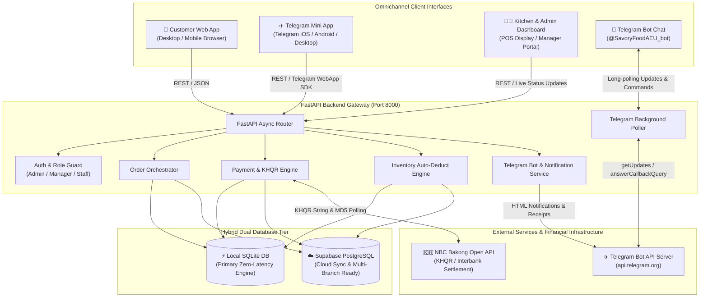
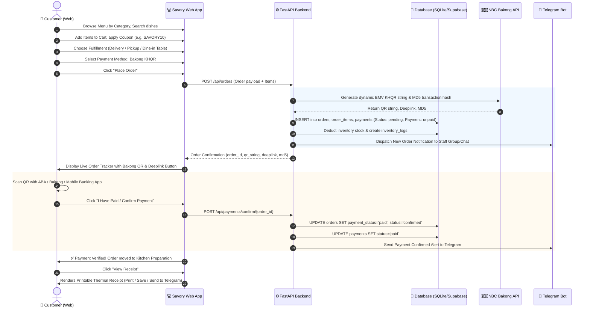
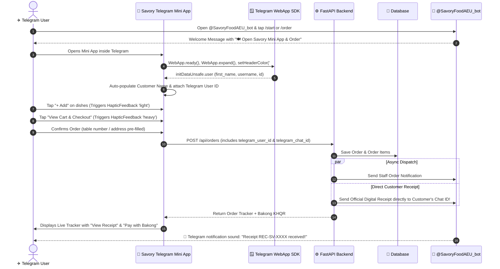
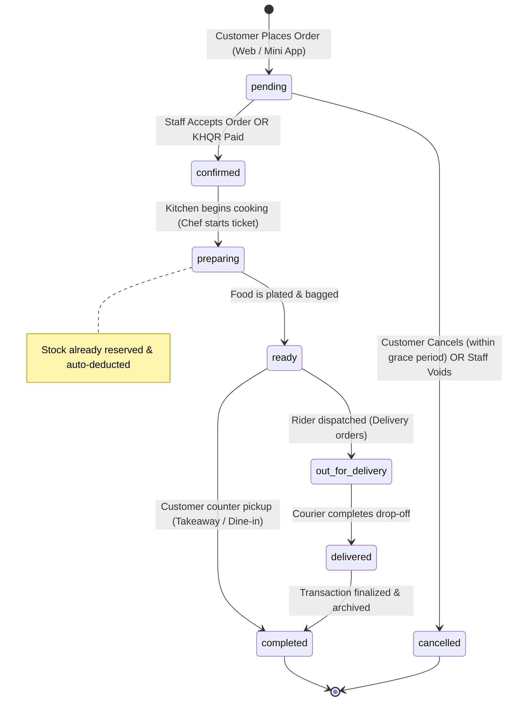
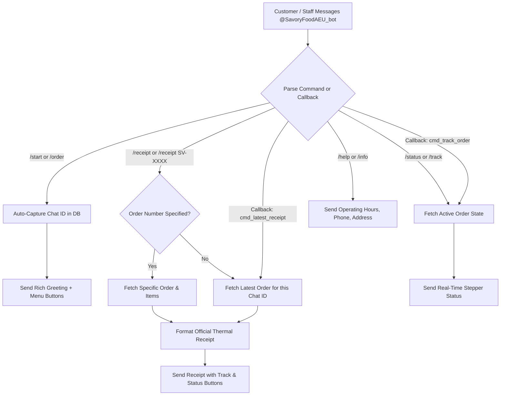
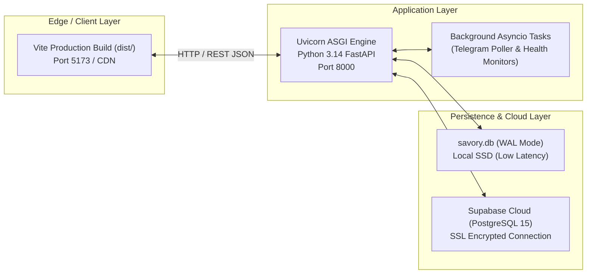

# Savory Food Ordering & Restaurant Management System
## Application Flow & System Architecture Proposal

---

## 1. Executive Summary & Architecture Overview

**Savory** is an enterprise-grade, omnichannel food ordering and restaurant management platform designed for quick-service restaurants, cafes, and multi-channel dining establishments. The platform operates simultaneously across three primary customer and operational interfaces:

1. **Responsive Customer Web Portal** (`/`, `/order`, `/menu`) — Mobile and desktop web ordering with live order tracking and interactive thermal receipts.
2. **Telegram Mini App (TMA)** (`/tg`, `/miniapp`) — Frictionless zero-login in-chat ordering utilizing native Telegram WebApp SDK, haptics, and automatic profile sync.
3. **Admin & Kitchen Operations Dashboard** (`/admin`) — Real-time live kitchen display system (KDS), menu manager, table floor plan, coupons, inventory control, and financial reporting.

### Core Technology Stack
- **Frontend Client**: React 18, TypeScript, Vite, Tailwind CSS, Lucide Icons, Telegram WebApp SDK (`@telegram-apps/sdk`).
- **Backend API**: Python 3.14, FastAPI (Asynchronous REST API, Uvicorn ASGI).
- **Database Engine**: **Hybrid Dual-Engine Architecture** — High-speed embedded SQLite (`backend/savory.db`) for sub-millisecond local POS latency + Cloud Supabase PostgreSQL for cloud synchronization.
- **Payment Gateway**: National Bank of Cambodia (NBC) **Bakong KHQR** (EMVCo dynamic QR specification, MD5 polling verification, mobile banking deep-linking) + Cash Counter payment.
- **Notification & Messaging Service**: Telegram Bot API (`@SavoryFoodAEU_bot`) for automated kitchen alerts, customer receipts, and interactive command polling.

---

## 2. High-Level System Architecture

---

## 3. End-to-End User Journeys & Application Flows

### Flow 1: Customer Web Ordering & Dynamic KHQR Payment

---

### Flow 2: Telegram Mini App (TMA) Frictionless Flow

---

### Flow 3: Kitchen & Staff Order Fulfillment Lifecycle

#### Order Status Transition Matrix:

| Status Code | Display Label | Responsible Role | System Action Triggered |
|---|---|---|---|
| `pending` | Order Placed | Customer / Bot | Order created, Bakong QR generated, inventory deducted, Telegram alert sent. |
| `confirmed` | Accepted | Staff / Manager | Payment verified or counter cash approved, order enters kitchen queue. |
| `preparing` | Cooking | Kitchen Staff | Chef preparing dish, estimated time countdown starts. |
| `ready` | Ready for Pickup | Kitchen / Counter | Kitchen bell rings, Telegram alert sends to customer/courier. |
| `out_for_delivery` | Out for Delivery | Courier / Staff | GPS live tracking active, delivery timer started. |
| `delivered` | Delivered | Courier / Customer | Drop-off confirmed at customer coordinates. |
| `completed` | Completed | System / Manager | Order closed, financial logs tallied for sales report. |
| `cancelled` | Cancelled | Customer / Admin | Order voided, inventory quantities automatically replenished. |

---

### Flow 4: Telegram Bot Automated Service & Command Poller

---

## 4. Security, Roles & Access Control Matrix

The platform enforces a 4-tier Role-Based Access Control (RBAC) model:

| Capability / Module | Customer (Guest & Telegram) | Staff (Counter & Kitchen) | Manager | Administrator |
|---|:---:|:---:|:---:|:---:|
| Browse Menu & Categories | ✅ | ✅ | ✅ | ✅ |
| Order Food & KHQR Checkout | ✅ | ✅ | ✅ | ✅ |
| View Personal Order & Receipts | ✅ | ✅ | ✅ | ✅ |
| Kitchen Display & Order Kanban | ❌ | ✅ | ✅ | ✅ |
| Update Order & Payment Status | ❌ | ✅ | ✅ | ✅ |
| Void / Cancel Orders | ❌ (Pending only) | ❌ | ✅ | ✅ |
| Menu Item CRUD & Pricing | ❌ | ❌ | ✅ | ✅ |
| Inventory Restock & Stock Logs | ❌ | ✅ (View/Adjust) | ✅ | ✅ |
| Sales Reports & CSV Financial Export | ❌ | ❌ | ✅ | ✅ |
| Telegram Bot & System Settings | ❌ | ❌ | ❌ | ✅ |
| Staff Management & Role Assignment | ❌ | ❌ | ❌ | ✅ |

---

## 5. Deployment & Infrastructure Architecture

