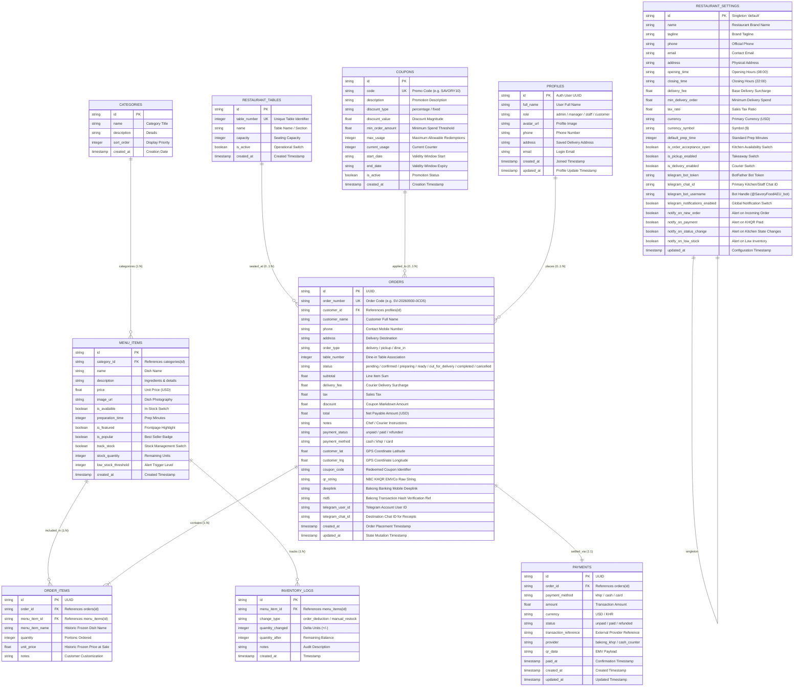

# Savory Food Ordering & Restaurant Management System
## Database Design & Data Architecture Proposal

---

## 1. Architectural Strategy & Design Rationale

The database architecture for **Savory** utilizes an enterprise-grade **Hybrid Dual-Engine Strategy**:

```
                       ┌─────────────────────────────────────────┐
                       │        FastAPI Application Layer        │
                       └────────────────────┬────────────────────┘
                                            │
                     ┌──────────────────────┴──────────────────────┐
                     ▼                                             ▼
       ┌───────────────────────────┐                 ┌───────────────────────────┐
       │   Embedded SQLite Engine  │                 │    Supabase Cloud Engine  │
       │    (savory.db - Primary)  │                 │   (PostgreSQL 15 - Cloud) │
       ├───────────────────────────┤                 ├───────────────────────────┤
       │ • Sub-millisecond latency │                 │ • Remote management       │
       │ • Offline POS resilience  │                 │ • Mobile owner monitoring │
       │ • Zero network overhead   │                 │ • Row-Level Security(RLS) │
       │ • ACID local transactions │                 │ • Centralized analytics   │
       └───────────────────────────┘                 └───────────────────────────┘
```

### Key Architectural Advantages:
1. **High-Speed Local POS Operations**: Cashier counter checkout and kitchen tickets are committed to embedded SQLite (`savory.db`) in under 2ms, avoiding network latency bottlenecks.
2. **Offline Tolerance**: If the local ISP or internet connection drops, the in-restaurant ordering, kitchen display, and counter cash register continue functioning without interruption.
3. **Cloud Synchronization**: Every transaction is asynchronously committed to Supabase Cloud PostgreSQL, providing off-site disaster recovery, remote analytics, and multi-branch scalability.
4. **EMVCo Payment Traceability**: Transaction hashes (`md5`), KHQR payloads (`qr_string`), and Telegram chat linkages are stored alongside order records for end-to-end reconciliation.

---

## 2. Entity-Relationship Diagram (ERD)



---

## 3. Data Dictionary & Detailed Table Specifications

### 3.1 `categories`
Organizes the menu catalog into logical dining courses and sections (Burgers, Pizzas, Drinks, Desserts).

| Field | Type (SQLite / PG) | Nullable | Default | Description |
|---|---|:---:|---|---|
| `id` | `TEXT` / `UUID` | No | PK | Unique category identifier (UUID v4) |
| `name` | `TEXT` / `VARCHAR(100)` | No | — | Category title (e.g. *Burgers*, *Pizzas*) |
| `description` | `TEXT` | Yes | `''` | Brief description of dishes in this section |
| `sort_order` | `INTEGER` | No | `0` | Ascending sort index for UI navigation tabs |
| `created_at` | `TEXT` / `TIMESTAMP` | No | `CURRENT_TIMESTAMP` | Record creation audit timestamp |

---

### 3.2 `menu_items`
Stores the complete menu catalog, pricing, operational metadata, and real-time inventory limits.

| Field | Type (SQLite / PG) | Nullable | Default | Description |
|---|---|:---:|---|---|
| `id` | `TEXT` / `UUID` | No | PK | Unique dish identifier (UUID v4) |
| `category_id` | `TEXT` / `UUID` | No | FK | References `categories(id)` with CASCADE delete |
| `name` | `TEXT` / `VARCHAR(200)` | No | — | Commercial dish title (e.g. *Savory Classic Burger*) |
| `description` | `TEXT` | Yes | `''` | Detailed dish description and ingredients |
| `price` | `REAL` / `NUMERIC(10,2)` | No | — | Selling price in USD (e.g. `8.99`) |
| `image_url` | `TEXT` | Yes | `NULL` | Public CDN URL for high-resolution dish photo |
| `is_available` | `INTEGER` / `BOOLEAN`| No | `1` / `true` | Kitchen item toggle (0 = 86'd / out of stock) |
| `sort_order` | `INTEGER` | No | `0` | Display ordering within the parent category |
| `preparation_time` | `INTEGER` | No | `20` | Estimated preparation duration in minutes |
| `is_featured` | `INTEGER` / `BOOLEAN`| No | `0` / `false`| Highlight on customer homepage banner |
| `is_popular` | `INTEGER` / `BOOLEAN`| No | `0` / `false`| Display "Popular" badge on food cards |
| `track_stock` | `INTEGER` / `BOOLEAN`| No | `1` / `true` | Enable real-time inventory tracking |
| `stock_quantity` | `INTEGER` | No | `50` | Current available inventory count |
| `low_stock_threshold`| `INTEGER` | No | `5` | Threshold triggering Telegram low-stock alert |
| `created_at` | `TEXT` / `TIMESTAMP` | No | `CURRENT_TIMESTAMP` | Record creation timestamp |

---

### 3.3 `orders`
The central transaction record holding customer, fulfillment, geolocation, payment, and Telegram tracking data.

| Field | Type (SQLite / PG) | Nullable | Default | Description |
|---|---|:---:|---|---|
| `id` | `TEXT` / `UUID` | No | PK | Unique order identifier (UUID v4) |
| `order_number` | `TEXT` / `VARCHAR(30)` | No | UNIQUE | Human-readable receipt number (`SV-YYYYMMDD-XXXX`) |
| `customer_id` | `TEXT` / `UUID` | Yes | `NULL` | References `profiles(id)` (NULL for guest/mini-app) |
| `customer_name`| `TEXT` / `VARCHAR(150)`| No | — | Customer full name (auto-filled from Telegram) |
| `phone` | `TEXT` / `VARCHAR(30)` | Yes | `NULL` | Contact phone number for rider or kitchen |
| `address` | `TEXT` | Yes | `NULL` | Delivery street address and instructions |
| `order_type` | `TEXT` / `VARCHAR(20)` | No | `'delivery'` | Channel: `'delivery'`, `'pickup'`, `'dine_in'` |
| `table_number` | `INTEGER` | Yes | `NULL` | Restaurant table number for dine-in orders |
| `status` | `TEXT` / `VARCHAR(30)` | No | `'pending'` | Kitchen state: `pending`, `confirmed`, `preparing`, `ready`, `out_for_delivery`, `delivered`, `completed`, `cancelled` |
| `subtotal` | `REAL` / `NUMERIC(10,2)` | No | `0.00` | Sum of item lines before delivery & discounts |
| `delivery_fee` | `REAL` / `NUMERIC(10,2)` | No | `0.00` | Courier shipping charge (e.g. `$2.50`) |
| `tax` | `REAL` / `NUMERIC(10,2)` | No | `0.00` | Applied VAT / sales tax |
| `discount` | `REAL` / `NUMERIC(10,2)` | No | `0.00` | Markdown from coupons or promotions |
| `total` | `REAL` / `NUMERIC(10,2)` | No | — | Final gross payable total amount in USD |
| `notes` | `TEXT` | Yes | `NULL` | Special food preparations or delivery notes |
| `payment_status`| `TEXT` / `VARCHAR(20)` | No | `'unpaid'` | Settlement state: `'unpaid'`, `'paid'`, `'refunded'` |
| `payment_method`| `TEXT` / `VARCHAR(20)` | No | `'cash'` | Gateway method: `'cash'`, `'khqr'`, `'card'` |
| `customer_lat` | `REAL` / `FLOAT8` | Yes | `NULL` | Customer GPS latitude coordinate |
| `customer_lng` | `REAL` / `FLOAT8` | Yes | `NULL` | Customer GPS longitude coordinate |
| `coupon_code` | `TEXT` / `VARCHAR(50)` | Yes | `NULL` | Applied coupon promotion code |
| `qr_string` | `TEXT` | Yes | `NULL` | Full EMVCo KHQR string generated for payment |
| `deeplink` | `TEXT` | Yes | `NULL` | Bakong mobile banking redirect URL |
| `md5` | `TEXT` / `VARCHAR(64)` | Yes | `NULL` | 32-character transaction hash for Bakong polling |
| `telegram_user_id`| `TEXT` / `VARCHAR(50)`| Yes | `NULL` | Customer Telegram account identifier |
| `telegram_chat_id`| `TEXT` / `VARCHAR(50)`| Yes | `NULL` | Destination chat ID for digital receipt dispatch |
| `created_at` | `TEXT` / `TIMESTAMP` | No | `CURRENT_TIMESTAMP` | Order placement timestamp |
| `updated_at` | `TEXT` / `TIMESTAMP` | No | `CURRENT_TIMESTAMP` | Last status modification timestamp |

---

### 3.4 `order_items`
Contains individual item lines for an order. **Price & Name Snapshotting** guarantees historical fidelity even if menu prices change later.

| Field | Type (SQLite / PG) | Nullable | Default | Description |
|---|---|:---:|---|---|
| `id` | `TEXT` / `UUID` | No | PK | Unique line item record ID |
| `order_id` | `TEXT` / `UUID` | No | FK | References `orders(id)` with CASCADE delete |
| `menu_item_id` | `TEXT` / `UUID` | No | FK | References `menu_items(id)` |
| `menu_item_name`| `TEXT` / `VARCHAR(200)`| Yes | `NULL` | Snapshot of dish name at the moment of sale |
| `quantity` | `INTEGER` | No | `1` | Number of portions ordered |
| `unit_price` | `REAL` / `NUMERIC(10,2)` | No | — | Snapshot of unit price at the moment of sale |
| `notes` | `TEXT` | Yes | `NULL` | Item-specific requests (*no onions*, *extra ice*) |

---

### 3.5 `payments`
Tracks financial payment transactions, settlement providers, and verification references.

| Field | Type (SQLite / PG) | Nullable | Default | Description |
|---|---|:---:|---|---|
| `id` | `TEXT` / `UUID` | No | PK | Unique payment record ID |
| `order_id` | `TEXT` / `UUID` | No | FK | References `orders(id)` |
| `payment_method`| `TEXT` / `VARCHAR(20)` | No | `'cash'` | Method: `'khqr'`, `'cash'`, `'card'` |
| `amount` | `REAL` / `NUMERIC(10,2)` | No | — | Settled transaction amount |
| `currency` | `TEXT` / `VARCHAR(10)` | No | `'USD'` | Transaction currency (`'USD'`, `'KHR'`) |
| `status` | `TEXT` / `VARCHAR(20)` | No | `'unpaid'` | Status: `'unpaid'`, `'paid'`, `'failed'` |
| `transaction_reference`| `TEXT` | Yes | `NULL` | Bank confirmation ID or Bakong MD5 hash |
| `provider` | `TEXT` / `VARCHAR(50)` | No | `'cash_counter'`| Gateway: `'bakong_khqr'`, `'cash_counter'` |
| `qr_data` | `TEXT` | Yes | `NULL` | Static or dynamic QR code payload |
| `paid_at` | `TEXT` / `TIMESTAMP` | Yes | `NULL` | Timestamp when payment was verified |
| `created_at` | `TEXT` / `TIMESTAMP` | No | `CURRENT_TIMESTAMP` | Initial transaction creation date |
| `updated_at` | `TEXT` / `TIMESTAMP` | No | `CURRENT_TIMESTAMP` | Modification timestamp |

---

### 3.6 `inventory_logs`
An append-only audit trail logging every stock deduction and manual inventory restock.

| Field | Type (SQLite / PG) | Nullable | Default | Description |
|---|---|:---:|---|---|
| `id` | `TEXT` / `UUID` | No | PK | Unique log event ID |
| `menu_item_id` | `TEXT` / `UUID` | No | FK | References `menu_items(id)` |
| `change_type` | `TEXT` / `VARCHAR(50)` | No | — | Type: `'order_deduction'`, `'manual_restock'` |
| `quantity_changed`| `INTEGER` | No | — | Delta value (negative for orders, positive for restock) |
| `quantity_after` | `INTEGER` | No | — | Stock balance immediately after this transaction |
| `notes` | `TEXT` | Yes | `NULL` | Associated order number or staff audit reason |
| `created_at` | `TEXT` / `TIMESTAMP` | No | `CURRENT_TIMESTAMP` | Event timestamp |

---

### 3.7 `restaurant_settings`
Singleton configuration entity governing restaurant operating rules, delivery fees, and Telegram bot credentials.

| Field | Type (SQLite / PG) | Nullable | Default | Description |
|---|---|:---:|---|---|
| `id` | `TEXT` | No | PK (`'default'`) | Fixed singleton identifier |
| `name` | `TEXT` | No | `'Savory'` | Restaurant legal / trading name |
| `tagline` | `TEXT` | Yes | `'Fresh food...'`| Marketing slogan |
| `phone` | `TEXT` | Yes | — | Official store contact telephone |
| `email` | `TEXT` | Yes | — | Official business inquiry email |
| `address` | `TEXT` | Yes | — | Physical store location |
| `opening_time` | `TEXT` | No | `'08:00'` | Daily opening time (HH:MM) |
| `closing_time` | `TEXT` | No | `'22:00'` | Daily closing time (HH:MM) |
| `delivery_fee` | `REAL` | No | `2.50` | Standard delivery surcharge (USD) |
| `min_delivery_order`| `REAL` | No | `10.00` | Minimum order subtotal required for delivery |
| `tax_rate` | `REAL` | No | `0.00` | Applied tax percentage (0.00 = 0%) |
| `currency` | `TEXT` | No | `'USD'` | Operational currency |
| `currency_symbol`| `TEXT` | No | `'$'` | UI currency symbol |
| `default_prep_time`| `INTEGER` | No | `20` | Standard preparation benchmark in minutes |
| `is_order_acceptance_open` | `INTEGER` | No | `1` | Master restaurant online ordering switch |
| `is_pickup_enabled` | `INTEGER` | No | `1` | Enable/disable takeaway orders |
| `is_delivery_enabled` | `INTEGER` | No | `1` | Enable/disable courier delivery |
| `telegram_bot_token` | `TEXT` | Yes | `''` | HTTP API token from @BotFather |
| `telegram_chat_id` | `TEXT` | Yes | `''` | Target Chat ID for kitchen orders & receipts |
| `telegram_bot_username`| `TEXT` | Yes | `'@SavoryFoodAEU_bot'` | Public Telegram bot handle |
| `telegram_notifications_enabled` | `INTEGER` | No | `1` | Master toggle for Telegram bot alerts |
| `notify_on_new_order` | `INTEGER` | No | `1` | Send alert when new order arrives |
| `notify_on_payment` | `INTEGER` | No | `1` | Send alert when KHQR payment confirmed |
| `notify_on_status_change`| `INTEGER` | No | `1` | Send alert when kitchen updates status |
| `notify_on_low_stock` | `INTEGER` | No | `1` | Send alert when inventory drops below threshold |
| `updated_at` | `TEXT` | No | `CURRENT_TIMESTAMP` | Last settings modification timestamp |

---

## 4. Key Business Rules & Data Integrity Protections

1. **Historic Price Freezing (Price Snapshotting)**:
   - When a dish price is updated in `menu_items`, existing records in `order_items` remain unmodified because `order_items.unit_price` snapshots the exact price charged at checkout. This ensures financial audit integrity.
2. **Atomic Inventory Reservation**:
   - Order submission executes within a single database transaction. For each item ordered with `track_stock = 1`, the system checks `stock_quantity >= quantity`, decrements the quantity, and appends an `inventory_logs` row.
3. **Inventory Auto-Replenishment on Cancellation**:
   - If an order with status `pending` or `confirmed` is cancelled, the system automatically reverses the deduction, restoring stock quantities and logging a `change_type = 'order_cancellation'` event.
4. **Idempotent Telegram Chat Binding**:
   - Customer and staff Telegram Chat IDs are validated for numeric format (`1100491434`), preventing Telegram API `400 Bad Request` or `Forbidden` error loops.
5. **EMVCo Payment Hash Uniqueness**:
   - The Bakong transaction MD5 hash is stored in `orders.md5` and `payments.transaction_reference` with indexed lookup for fast polling during checkout.

---

## 5. Performance Indexing & Query Optimizations

To maintain sub-5ms API response times even with tens of thousands of historical tickets, the following database indexes are applied:

```sql
-- Fast order lookup by receipt code (e.g. SV-20260930-0CD5)
CREATE UNIQUE INDEX IF NOT EXISTS idx_orders_order_number ON orders(order_number);

-- Accelerated kitchen Kanban board queries filtering by active status
CREATE INDEX IF NOT EXISTS idx_orders_status_created ON orders(status, created_at DESC);

-- Accelerated customer order history & Telegram bot /receipt lookup
CREATE INDEX IF NOT EXISTS idx_orders_telegram_chat ON orders(telegram_chat_id, created_at DESC);

-- Fast menu navigation filtering by category
CREATE INDEX IF NOT EXISTS idx_menu_items_category ON menu_items(category_id, is_available);

-- Fast coupon validation
CREATE UNIQUE INDEX IF NOT EXISTS idx_coupons_code ON coupons(code);

-- Fast inventory audit queries
CREATE INDEX IF NOT EXISTS idx_inventory_item_created ON inventory_logs(menu_item_id, created_at DESC);
```
